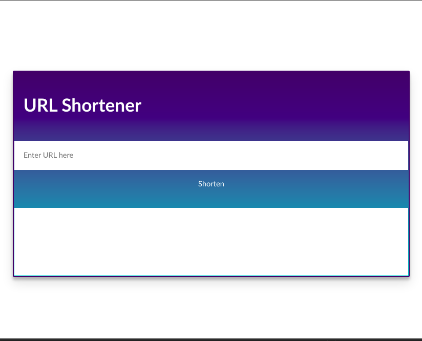
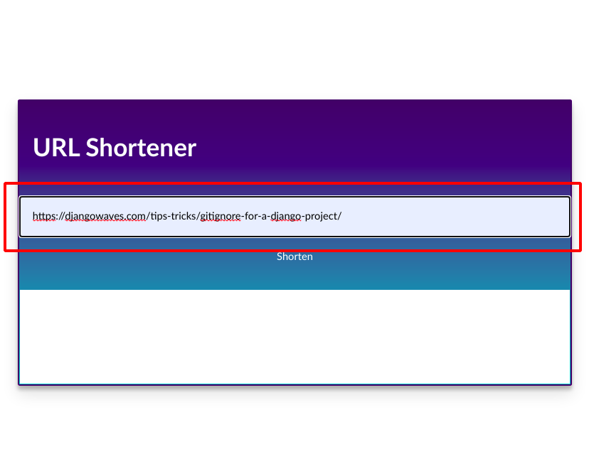
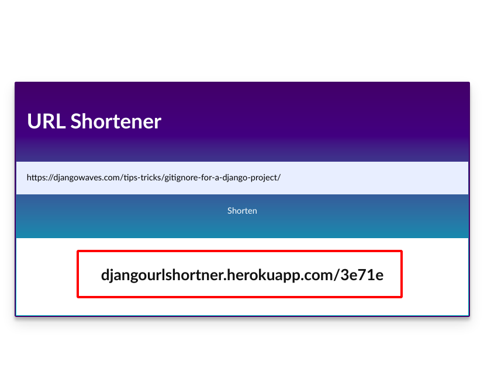

## A URL Shortner made in  Django
A heroku deployment to the Django App can be found at https://djangourlshortner.herokuapp.com/


#### This is the main static page serverd by the [index.html](templates/index.html) file served in the templates folder



## Steps to operate
### 1. Enter the long URL in the address bar

### 2. Click Shorten to add the URL to our database

### 3. Paste this URL in the address bar to get redirected to the correct page


## Backend details
API end points available
```
/ 

The main display endpoint that reders the page template and displays the index template.


/create

On submitting the form, it creates a new database entry for the shortened URL after creating a uuid for it.

/<str:pk>

Is the redirection URL that is obtained from the database
```
